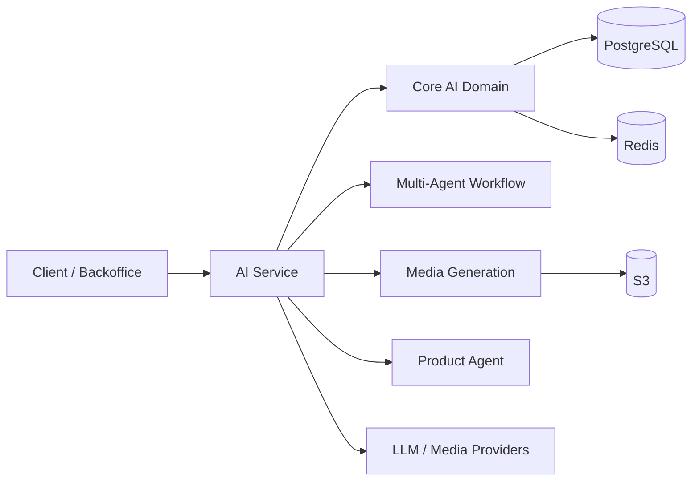

# Omnilude AI Service Showcase

`Omnilude`의 AI 기능을 담당하는 핵심 마이크로서비스를 공개용으로 분리한 showcase 저장소입니다.

이 저장소는 `2025.11`부터 진행 중인 개인 프로젝트 `Omnilude`의 일부이며, Kotlin/Spring 기반 AI 플랫폼 설계, 멀티에이전트 워크플로우, 미디어 생성, 백오피스 운영 구조, Kubernetes 배포 흐름을 검토할 수 있도록 정리했습니다.

## Positioning

- 이 저장소는 `실행 가능한 독립 OSS`보다 `설계/구현 포트폴리오`에 가깝습니다.
- 원본 private monorepo에서 `git subtree split --prefix=modules/ai-service`로 분리했습니다.
- 일부 공통 모듈과 운영 설정은 비공개라 standalone 실행은 보장하지 않습니다.

## Quick Facts

- 기간: `2025.11 - 현재`
- 형태: `개인 프로젝트 / 1인 개발`
- 역할: 백엔드, 프론트엔드, 배포, Kubernetes 운영 구조 설계 및 구현 전반 수행
- AI 활용: 설계, 구현, 리팩토링, 테스트 보조, 문서화, 배포 설정 전반에 AI 코딩 도구 활용

## What This Service Covers

- AI thread / message / run 관리
- agent / assistant / model / provider 관리
- multi-agent workflow 및 skill 실행 구조
- media generation 및 prompt enhancement
- product agent 기반 카피/이미지 생성
- SSE 기반 스트리밍 응답
- backoffice-driven configuration 및 운영 도메인

## Why This Repo Exists

`Omnilude`는 AI-assisted development가 실제 제품 규모의 개발을 어디까지 밀어줄 수 있는지 확인하기 위해 시작했습니다. 초기에는 구현 속도와 범위를 실험하는 성격이 강했지만, 현재는 다음 질문까지 포함하는 프로젝트로 확장되었습니다.

- AI 기능을 단순 API 연동이 아니라 서비스/플랫폼 차원에서 어떻게 설계할 것인가
- 1인 개발 환경에서 어디까지 구조화된 시스템을 운영할 수 있는가
- 빠른 구현을 실제 운영 가능한 구조로 어떻게 연결할 것인가

## Architecture Snapshot

## Tech Stack

- Backend: `Kotlin`, `Spring Boot`, `Spring Web`, `WebFlux`, `JPA`, `Actuator`, `QueryDSL`
- AI/LLM: `LangChain4j`, `OpenAI`, `Anthropic`, `Ollama`, `Mistral`, `Tavily`, `ChromaDB`
- Data/Infra: `PostgreSQL`, `Redis`, `AWS S3`, `Docker`, `Kubernetes`, `Jenkins`, `Kaniko`
- Runtime patterns: `SSE streaming`, `provider/model abstraction`, `workflow execution`, `long-running job tracking`

## Code Areas To Review First

1. `src/main/kotlin/com/jongmin/ai/AiApplication.kt`
2. `src/main/kotlin/com/jongmin/ai/core`
3. `src/main/kotlin/com/jongmin/ai/multiagent`
4. `src/main/kotlin/com/jongmin/ai/generation`
5. `src/main/kotlin/com/jongmin/ai/product_agent`

## What Is Intentionally Missing

이 저장소는 공개용으로 분리된 snapshot이므로 아래는 포함하지 않거나 그대로 사용할 수 없습니다.

- private common modules (`jspring` 계열)
- private monorepo의 다른 서비스들
- 운영 시크릿, 내부 설정, 상용 데이터
- 전체 시스템을 그대로 재현하기 위한 infra 자산

즉, 이 저장소는 `동작 재현용 샘플`보다 `설계와 구현 검토용 포트폴리오`로 봐주시면 됩니다.

## Related Writing

- [Jenkins + Kubernetes 기반 서비스별 선택 배포를 어떻게 설계했는가](https://blog.omnilude.com/posts/jenkins-k8s-selective-deploy)
- [하나였던 Omnilude 백엔드를 AI와 함께 MSA로 전환한 과정](https://blog.omnilude.com/posts/omnilude-monolith-to-msa-transition)
- [향상된 챗봇 에이전트의 Workflow를 소개합니다](https://blog.omnilude.com/posts/omnilude-ai-agent-3-workflow)
